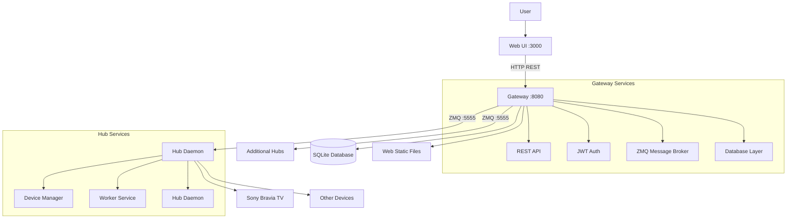

# Lucas

Lucas is a simple home automation proxy that provides secure external access to household devices without exposing them directly to the internet.

## What is Lucas?

**Problem**: Household devices (TVs, smart home devices) shouldn't be directly exposed to the internet for security reasons.

**Solution**: Lucas acts as a secure proxy/tunnel to your home devices, giving you one secure endpoint instead of many vulnerable device endpoints.

**Origin Story**: 
1. Started as a simple TV remote control client for Sony Bravia TVs
2. Built a hub to normalize device control interfaces  
3. Added a gateway for secure external access without device exposure
4. Result: Control your home devices from anywhere, securely

**Philosophy**: KISS (Keep It Simple, Stupid) - this is a small household application, not an enterprise system.

## Architecture



## Components

### 🌐 Gateway
- **Purpose**: Secure proxy server that can be exposed to the internet
- **Services**: REST API, JWT authentication, ZMQ message broker, SQLite database
- **Port**: 8080 (HTTP API), 5555 (ZMQ broker)
- **Location**: Typically deployed on a VPS or public server

### 🏠 Hub  
- **Purpose**: Local daemon that runs in your household and controls devices
- **Services**: Device manager, ZMQ worker service, daemon process
- **Location**: Runs on local network (Raspberry Pi, old computer, etc.)
- **Security**: Stays internal, never exposed to internet

### 📱 Web UI
- **Purpose**: User interface for controlling devices remotely
- **Technology**: Svelte 5, TypeScript, optimized for mobile
- **Size**: 121KB JS (41KB gzipped), 21KB CSS (3.8KB gzipped)  
- **Access**: Served by gateway at port 8080 (embedded static files)

### 🔧 CLI
- **Purpose**: Testing and verification tool for hub interaction
- **Use cases**: Hub setup, device testing, debugging
- **Not for**: Primary user interaction (use web UI instead)

## Quick Start

### 1. Set up Gateway (on public server)
```bash
# Initialize gateway with default configuration  
./lucas gateway init

# Start gateway daemon
./lucas gateway
```

### 2. Set up Hub (on home network)  
```bash
# Initialize hub and register with gateway
./lucas hub init --gateway-url http://your-gateway-server:8080

# Start hub daemon  
./lucas hub
```

### 3. Access Web Interface
Open `http://your-gateway-server:8080` in your browser to control devices.

## Device Support

### Sony Bravia TVs
Lucas includes comprehensive support for Sony Bravia TV control:

**Remote Control Actions**: power, volume up/down, mute, channel up/down, navigation (up/down/left/right), confirm, home, menu, back, input switching (HDMI1-4)

**System Control**: power status, system info, volume info, playing content, app list, content list

**Protocol**: IRCC (Infrared Compatible Control over IP) + JSON-RPC

**Control Methods**: 
- Web UI (primary method for users)
- Hub test mode: `./lucas hub --test` (simulates device responses)
- Interactive CLI: `./lucas cli` (setup and testing)

## Configuration

### Hub Configuration (hub.yml)
```yaml
gateway:
  endpoint: "tcp://your-gateway:5555"  
  public_key: "gateway-curve-public-key"

hub:
  id: "hub_ec8ad6e1-1d4c-46b8-b872-9df4e257ffff"
  name: "Living Room Hub" 
  public_key: "hub-curve-public-key"
  private_key: "hub-curve-private-key"
  product_key: "unique-product-identifier"

devices:
  - id: "living_room_tv"
    type: "bravia"
    name: "Living Room TV"
    address: "192.168.1.100:80"
    credential: "0000"
    capabilities: ["remote_control", "system_control"]
```

### Gateway Configuration (gateway.yml)
```yaml
server:
  zmq:
    address: "tcp://*:5555"
  api:
    address: ":8080"

database:
  path: "gateway.db"

keys:
  file: "gateway_keys.yml"

logging:
  level: "info"

jwt:
  secret: "auto-generated"
  expiry: "24h"
```

## Security

Lucas implements multiple security layers:

- **CurveZMQ Encryption**: All ZMQ communication uses curve25519 encryption
- **JWT Authentication**: Web API uses JWT tokens for user sessions  
- **Key Management**: Automatic generation and secure storage of cryptographic keys
- **Nonce Protection**: Request deduplication to prevent replay attacks
- **Proxy Architecture**: Devices never exposed to internet, only gateway is public

## Building

### Prerequisites
- Go 1.23+
- Node.js & npm (for web frontend)

### Standard Build
```bash
# Clone and build
git clone <repository-url>
cd lucas

# Build backend
go build -o lucas main.go

# Build web frontend  
cd web
npm install
npm run build
cd ..

# Run
./lucas --help
```

### Cross-Platform Build
```bash
# Linux ARM64 (Raspberry Pi)
GOOS=linux GOARCH=arm64 go build -o lucas-linux-arm64 main.go

# Linux AMD64
GOOS=linux GOARCH=amd64 go build -o lucas-linux-amd64 main.go
```

## Development

### Running in Development
```bash
# Gateway with debug logging
./lucas gateway --debug

# Hub with test mode (simulates device responses)
./lucas hub --debug --test

# Web frontend dev server
cd web && npm run dev
```

### Adding New Device Types
1. Implement device interface in `internal/device/`
2. Add device type to hub configuration schema
3. Register device handler in `internal/hub/device_manager.go`
4. Test with hub test mode: `./lucas hub --test`

## Troubleshooting

### "service not available: device.bravia"
- **Real cause**: Hub not connected to gateway (connectivity issue)
- **Check**: Hub ZMQ connection status, hub registered as worker
- **Not**: Service discovery failure (Lucas doesn't use service discovery)

### "failed to parse service response: unexpected end of JSON input"  
- **Real cause**: Hub not responding or sending malformed responses
- **Check**: Hub logs, device connectivity from hub, response validation

### Request timeouts
- **Real cause**: Hub not responding within timeout period
- **Check**: Device response delays (some devices are slow), network latency
- **Solution**: Increase timeout, check network connectivity

## Technology Stack

**Backend**: Go 1.23, Cobra CLI, ZeroMQ with CurveZMQ, SQLite, Zerolog, JWT

**Frontend**: Svelte 5, TypeScript, Vite (optimized for performance and small bundle size)

**Protocol**: Custom "Hermes" messaging over ZMQ for simple proxy pattern (not service discovery)

## Deployment

**Typical Setup**: 
- Gateway on VPS/public server (internet accessible)
- Hub on home network (Raspberry Pi, old laptop, etc.)  
- Multiple hubs can connect to one gateway
- Security model: Only gateway exposed, hubs stay internal

## License

Licensed under the Apache License, Version 2.0. See LICENSE for details.